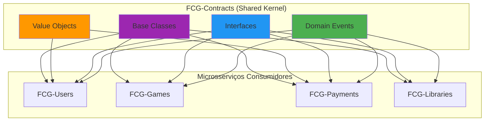

# 📦 FCG.Shared.Contracts

> **Shared Kernel** - Biblioteca de contratos compartilhados para comunicação assíncrona entre microsserviços

[](https://dotnet.microsoft.com/)
[](https://docs.microsoft.com/en-us/dotnet/csharp/)
[](https://martinfowler.com/articles/201701-event-driven.html)
[](https://martinfowler.com/bliki/DomainDrivenDesign.html)

## 🎯 O que é este projeto?

**FCG-Contracts** é o **núcleo compartilhado** (Shared Kernel) de toda a arquitetura de microsserviços FCG Games. Esta biblioteca centraliza **contratos de domínio**, **eventos** e **interfaces** que garantem **consistência semântica** e **interoperabilidade** entre todos os serviços distribuídos.

Em vez de duplicar definições de eventos em cada microsserviço, criamos uma **single source of truth** que:
- ✅ Elimina código duplicado
- ✅ Garante versionamento consistente de contratos
- ✅ Facilita evolução e refactoring
- ✅ Previne erros de comunicação entre serviços

---

## 🚀 Tecnologias e Padrões Aplicados

### Stack Técnico
| Tecnologia | Propósito | Conceito Aplicado |
|------------|-----------|-------------------|
| **.NET 8** | Runtime moderno | Performance e suporte LTS |
| **C# 12** | Linguagem | Records, Pattern Matching |
| **NuGet Package** | Distribuição | Versionamento semântico |

### Padrões de Design Implementados

#### 🏗️ **Domain-Driven Design (DDD)**
- **Entity Base Class**: Abstração de entidades com identidade única (Id, CreatedAt, UpdatedAt)
- **ValueObject Base Record**: Classe abstrata para Value Objects
- **Domain Events**: Representação de fatos ocorridos no domínio
- **Enums**: EOrderStatus, EPaymentStatus, EPaymentType

#### 📡 **Event-Driven Architecture (EDA)**
- **Event Sourcing Ready**: Eventos imutáveis como fonte da verdade
- **Publisher-Subscriber Pattern**: Interfaces para publicação/consumo
- **Event Store Pattern**: Interface de persistência de eventos

#### 🧩 **Shared Kernel Pattern**
- Contratos compartilhados entre bounded contexts
- Acoplamento mínimo, coesão máxima
- Versionamento explícito de contratos

---

## 📋 Estrutura de Eventos de Domínio

### 👤 **Eventos de Usuário**
```csharp
UserCreatedEvent        // Usuário registrado no sistema
UserDeletedEvent        // Usuário removido (GDPR compliance)
UserLoginEvent          // Auditoria de autenticação
```

### 💳 **Eventos de Pagamento**
```csharp
PaymentCreatedEvent     // Pagamento iniciado
PaymentProcessedEvent   // Pagamento aprovado/rejeitado
PaymentDeletedEvent     // Estorno ou cancelamento
```

### 🎮 **Eventos de Games**
```csharp
GameCreatedEvent        // Novo jogo cadastrado
GameUpdatedEvent        // Metadados alterados
GameDeletedEvent        // Jogo removido do catálogo
```

### 📚 **Eventos de Biblioteca**
```csharp
LibraryItemCreatedEvent // Jogo adicionado à biblioteca
LibraryItemUpdatedEvent // Status alterado (instalado, favorito)
LibraryItemDeletedEvent // Jogo removido da biblioteca
```

---

## 🔌 Interfaces de Infraestrutura

### **IDomainEvent**
Interface marker para todos os eventos de domínio. Garante estrutura consistente de eventos.

```csharp
public interface IDomainEvent
{
    string AggregateId { get; set; }
    DateTime OccurredOn { get; set; }
}
```

### **IEventPublisher**
Abstração para publicação de eventos em message brokers (Azure Service Bus).

```csharp
public interface IEventPublisher
{
    Task PublishAsync<T>(T @event, string subject, string correlationId) where T : class;
}
```

### **IEventStore**
Interface para implementação de Event Store (MongoDB).

```csharp
public interface IEventStore
{
    Task AppendAsync<T>(string streamId, T @event, int expectedVersion, string correlationId) where T : class;
    Task<List<T>> GetEventsAsync<T>(string streamId) where T : class;
}
```

### **Entity Base Class**
Classe abstrata para entidades de domínio com identidade única:

```csharp
public abstract class Entity(Guid id)
{
    public Guid Id { get; init; } = id;
    public DateTime CreatedAt { get; private set; }
    public DateTime? UpdatedAt { get; private set; }
    // Implementa IEquatable<Entity>
}
```

### **ValueObject Base Record**
Record abstrato para Value Objects:

```csharp
public abstract record ValueObject;
```

---

## 📦 Como Utilizar

### Exemplo de Uso em Microsserviço

```csharp
using FCG.Shared.Contracts.Events.Domain;

public class UserService
{
    private readonly IEventPublisher _publisher;
    
    public async Task CreateUserAsync(User user)
    {
        // 1. Persistir usuário
        await _repository.SaveAsync(user);
        
        // 2. Publicar evento de domínio
        {
            UserId = user.Id,
            Email = user.Email.Value,
            CreatedAt = DateTime.UtcNow
        };
        
        await _publisher.PublishAsync(@event);
    }
}
```

---

## 🏛️ Arquitetura - Diagrama Mermaid



---

## 🎓 Conceitos Avançados Aplicados

### **Bounded Context Mapping**
Esta biblioteca representa o **Shared Kernel** no mapa de contextos da arquitetura. Todos os bounded contexts (Users, Games, Payments, Libraries) compartilham este núcleo para comunicação.

### **Anti-Corruption Layer**
Os eventos servem como camada de proteção, isolando a lógica interna de cada microsserviço de mudanças externas.

### **Schema Evolution**
Versionamento de eventos permite evolução gradual sem quebrar consumidores existentes (Event Versioning Strategy).

---

## 📚 Referências Técnicas

- [Domain-Driven Design (Eric Evans)](https://www.domainlanguage.com/ddd/)
- [Event-Driven Architecture (Martin Fowler)](https://martinfowler.com/articles/201701-event-driven.html)
- [Shared Kernel Pattern (DDD)](https://thedomaindrivendesign.io/shared-kernel/)
- [.NET Event Sourcing](https://docs.microsoft.com/en-us/dotnet/architecture/microservices/microservice-ddd-cqrs-patterns/)

## Implementações

**StoredEvent**
- Implementação concreta de um evento armazenado.

**MongoEventStore**
- Implementação do IEventStore utilizando MongoDB como backend.

**ServiceBusEventPublisher**
- Implementação do IEventPublisher utilizando Azure Service Bus.


## Instalação

Adicione a referência ao pacote no seu projeto .NET:

```bash
dotnet add package FCG.Shared.Contracts
